# STOCK MARKET ANALYSIS

## A stock market, equity market or share market is the aggregation of buyers and sellers (a loose network of economic transactions, not a physical facility or discrete entity) of stocks (also called shares), which represent ownership claims on businesses; these may include securities listed on a public stock exchange, as well as stock that is only traded privately.

## DESCRIPTION:-

### The project actually analyses the stock market changes and also predicts the upcoming fluctuations in the level of stock market. The project is going to cover some very important factor in the stock market sector like ''daily return of stock on average'', ''moving average of various stocks'', ''correlation between different stocks closing prices'', also some other things. The project consists of different graphs for describing some important factors...


```python
#Some important libraries of python that are used are:-
import numpy as np
import sys
import pandas as pd
import matplotlib as mlt
import matplotlib.pyplot as plt 
import seaborn as sns
sns.set_style='Whitegrid'
import pandas_datareader as dr
from pandas_datareader import data
from datetime import datetime
import datetime
import pylab as pl
plt.grid()
%matplotlib inline

```

### The companies used are:-
#### Maruti (MARUTI.NS) , Hindustan unilever Ltd (HINDUNILVR.NS) , Reliance (RELIANCE.NS) , Bajaj Finance (BAJFINANCE.NS)


```python
print(f'Here is the list of some biggest companies in Stock Market area: {"MARUTI","HINDUNILVR","RELIANCE","BAJFINANCE"}')
```

    Here is the list of some biggest companies in Stock Market area: ('MARUTI', 'HINDUNILVR', 'RELIANCE', 'BAJFINANCE')
    


```python
#tech_list is the stock companies list created to store the names of the stock companies
tech_list=["MARUTI","HINDUNILVR","RELIANCE","BAJFINANCE"]
```


```python
tech_list
```


    ['MARUTI', 'HINDUNILVR', 'RELIANCE', 'BAJFINANCE']


Now we are going to put the start and end date to extract the stock data in that particular time only...


```python
# the date from where we want to start our analysis
start = input('Enter a start date in YYYY-MM-DD format: ')
year, month, day = map(int, start.split('-'))
date1 = datetime.date(year, month, day)
print(f'the start date is : {start}')

#it is the date till where we want to do our analysis
end = datetime.datetime.now().date()
print(f" the end date is : {end}")

```

    Enter a start date in YYYY-MM-DD format: 2016-06-14
    the start date is : 2016-06-14
     the end date is : 2020-08-14
    

## YAHOO FINANCE
So now we are going to use YAHOO FINANCE to extract the stock data and we are going to represent that data in the form of DATAFRAME to make it more understandable.


```python
#"df" is the short form for dataframe. 
#In this actually we use data science with python library GET_DATA_YAHOO to fetch the data between the start and the end date.. 
```


```python
#dr.data.get_data_yahoo is the python library used to extract data from yahoo using DatarRader"dr"
df_MARUTI= dr.data.get_data_yahoo("MARUTI.NS",start,end)

```


```python
df_HINDUNILVR= dr.data.get_data_yahoo("HINDUNILVR.NS",start,end)
```


```python
df_RELIANCE= dr.data.get_data_yahoo("RELIANCE.NS",start,end)
```


```python
df_BAJFINANCE= dr.data.get_data_yahoo("BAJFINANCE.NS",start,end)
```


```python
df_MARUTI
```


<div>
<style scoped>
    .dataframe tbody tr th:only-of-type {
        vertical-align: middle;
    }

    .dataframe tbody tr th {
        vertical-align: top;
    }

    .dataframe thead th {
        text-align: right;
    }
</style>
<table border="1" class="dataframe">
  <thead>
    <tr style="text-align: right;">
      <th></th>
      <th>High</th>
      <th>Low</th>
      <th>Open</th>
      <th>Close</th>
      <th>Volume</th>
      <th>Adj Close</th>
    </tr>
    <tr>
      <th>Date</th>
      <th></th>
      <th></th>
      <th></th>
      <th></th>
      <th></th>
      <th></th>
    </tr>
  </thead>
  <tbody>
    <tr>
      <th>2016-06-14</th>
      <td>4155.899902</td>
      <td>4096.000000</td>
      <td>4145.000000</td>
      <td>4104.500000</td>
      <td>403193.0</td>
      <td>3875.778076</td>
    </tr>
    <tr>
      <th>2016-06-15</th>
      <td>4215.000000</td>
      <td>4112.100098</td>
      <td>4125.000000</td>
      <td>4209.600098</td>
      <td>510807.0</td>
      <td>3975.021973</td>
    </tr>
    <tr>
      <th>2016-06-16</th>
      <td>4164.000000</td>
      <td>4062.000000</td>
      <td>4160.000000</td>
      <td>4084.100098</td>
      <td>1118517.0</td>
      <td>3856.515137</td>
    </tr>
    <tr>
      <th>2016-06-17</th>
      <td>4158.000000</td>
      <td>4093.449951</td>
      <td>4115.000000</td>
      <td>4114.500000</td>
      <td>951658.0</td>
      <td>3885.220947</td>
    </tr>
    <tr>
      <th>2016-06-20</th>
      <td>4144.799805</td>
      <td>4065.699951</td>
      <td>4076.550049</td>
      <td>4133.200195</td>
      <td>667114.0</td>
      <td>3902.878662</td>
    </tr>
    <tr>
      <th>2016-06-21</th>
      <td>4168.100098</td>
      <td>4109.000000</td>
      <td>4146.000000</td>
      <td>4157.399902</td>
      <td>512383.0</td>
      <td>3925.730225</td>
    </tr>
    <tr>
      <th>2016-06-22</th>
      <td>4180.500000</td>
      <td>4125.049805</td>
      <td>4145.000000</td>
      <td>4151.350098</td>
      <td>417540.0</td>
      <td>3920.017578</td>
    </tr>
    <tr>
      <th>2016-06-23</th>
      <td>4175.000000</td>
      <td>4120.450195</td>
      <td>4151.899902</td>
      <td>4168.600098</td>
      <td>341093.0</td>
      <td>3936.306396</td>
    </tr>
    <tr>
      <th>2016-06-24</th>
      <td>4092.100098</td>
      <td>3866.600098</td>
      <td>4053.000000</td>
      <td>4070.050049</td>
      <td>1559787.0</td>
      <td>3843.247803</td>
    </tr>
    <tr>
      <th>2016-06-27</th>
      <td>4061.000000</td>
      <td>4004.100098</td>
      <td>4061.000000</td>
      <td>4025.100098</td>
      <td>836629.0</td>
      <td>3800.802734</td>
    </tr>
    <tr>
      <th>2016-06-28</th>
      <td>4081.949951</td>
      <td>4040.000000</td>
      <td>4041.100098</td>
      <td>4078.699951</td>
      <td>626447.0</td>
      <td>3851.415283</td>
    </tr>
    <tr>
      <th>2016-06-29</th>
      <td>4141.000000</td>
      <td>4089.199951</td>
      <td>4100.000000</td>
      <td>4131.250000</td>
      <td>646945.0</td>
      <td>3901.037354</td>
    </tr>
    <tr>
      <th>2016-06-30</th>
      <td>4200.000000</td>
      <td>4145.549805</td>
      <td>4179.899902</td>
      <td>4187.200195</td>
      <td>770542.0</td>
      <td>3953.870117</td>
    </tr>
    <tr>
      <th>2016-07-01</th>
      <td>4214.200195</td>
      <td>4132.000000</td>
      <td>4188.600098</td>
      <td>4165.399902</td>
      <td>804652.0</td>
      <td>3933.284424</td>
    </tr>
    <tr>
      <th>2016-07-04</th>
      <td>4190.500000</td>
      <td>4155.750000</td>
      <td>4171.000000</td>
      <td>4173.799805</td>
      <td>343648.0</td>
      <td>3941.215820</td>
    </tr>
    <tr>
      <th>2016-07-05</th>
      <td>4202.000000</td>
      <td>4150.000000</td>
      <td>4180.000000</td>
      <td>4173.350098</td>
      <td>282439.0</td>
      <td>3940.791260</td>
    </tr>
    <tr>
      <th>2016-07-07</th>
      <td>4189.899902</td>
      <td>4125.000000</td>
      <td>4181.100098</td>
      <td>4141.100098</td>
      <td>325843.0</td>
      <td>3910.339111</td>
    </tr>
    <tr>
      <th>2016-07-08</th>
      <td>4175.649902</td>
      <td>4126.000000</td>
      <td>4142.000000</td>
      <td>4161.799805</td>
      <td>261295.0</td>
      <td>3929.885010</td>
    </tr>
    <tr>
      <th>2016-07-11</th>
      <td>4285.899902</td>
      <td>4189.950195</td>
      <td>4190.000000</td>
      <td>4272.049805</td>
      <td>518428.0</td>
      <td>4033.991211</td>
    </tr>
    <tr>
      <th>2016-07-12</th>
      <td>4382.000000</td>
      <td>4291.000000</td>
      <td>4300.000000</td>
      <td>4370.399902</td>
      <td>688921.0</td>
      <td>4126.860352</td>
    </tr>
    <tr>
      <th>2016-07-13</th>
      <td>4360.000000</td>
      <td>4301.000000</td>
      <td>4350.000000</td>
      <td>4321.399902</td>
      <td>416940.0</td>
      <td>4080.591553</td>
    </tr>
    <tr>
      <th>2016-07-14</th>
      <td>4439.000000</td>
      <td>4326.000000</td>
      <td>4326.000000</td>
      <td>4428.299805</td>
      <td>637580.0</td>
      <td>4181.533691</td>
    </tr>
    <tr>
      <th>2016-07-15</th>
      <td>4493.549805</td>
      <td>4404.500000</td>
      <td>4450.000000</td>
      <td>4472.049805</td>
      <td>654076.0</td>
      <td>4222.846191</td>
    </tr>
    <tr>
      <th>2016-07-18</th>
      <td>4564.399902</td>
      <td>4432.399902</td>
      <td>4477.000000</td>
      <td>4454.750000</td>
      <td>684924.0</td>
      <td>4206.510254</td>
    </tr>
    <tr>
      <th>2016-07-19</th>
      <td>4499.000000</td>
      <td>4440.000000</td>
      <td>4455.200195</td>
      <td>4485.700195</td>
      <td>378788.0</td>
      <td>4235.736328</td>
    </tr>
    <tr>
      <th>2016-07-20</th>
      <td>4510.000000</td>
      <td>4452.049805</td>
      <td>4471.850098</td>
      <td>4469.149902</td>
      <td>357560.0</td>
      <td>4220.107910</td>
    </tr>
    <tr>
      <th>2016-07-21</th>
      <td>4493.049805</td>
      <td>4405.250000</td>
      <td>4489.000000</td>
      <td>4413.700195</td>
      <td>252227.0</td>
      <td>4167.748047</td>
    </tr>
    <tr>
      <th>2016-07-22</th>
      <td>4449.000000</td>
      <td>4405.000000</td>
      <td>4421.000000</td>
      <td>4414.700195</td>
      <td>339886.0</td>
      <td>4168.692383</td>
    </tr>
    <tr>
      <th>2016-07-25</th>
      <td>4565.000000</td>
      <td>4421.000000</td>
      <td>4427.000000</td>
      <td>4550.549805</td>
      <td>499616.0</td>
      <td>4296.972168</td>
    </tr>
    <tr>
      <th>2016-07-26</th>
      <td>4584.000000</td>
      <td>4451.149902</td>
      <td>4575.149902</td>
      <td>4471.299805</td>
      <td>1828186.0</td>
      <td>4222.137695</td>
    </tr>
    <tr>
      <th>...</th>
      <td>...</td>
      <td>...</td>
      <td>...</td>
      <td>...</td>
      <td>...</td>
      <td>...</td>
    </tr>
    <tr>
      <th>2020-07-06</th>
      <td>6147.700195</td>
      <td>5925.000000</td>
      <td>5963.450195</td>
      <td>6123.600098</td>
      <td>1385081.0</td>
      <td>6069.008789</td>
    </tr>
    <tr>
      <th>2020-07-07</th>
      <td>6250.000000</td>
      <td>6092.649902</td>
      <td>6140.000000</td>
      <td>6226.750000</td>
      <td>1799721.0</td>
      <td>6171.239258</td>
    </tr>
    <tr>
      <th>2020-07-08</th>
      <td>6235.000000</td>
      <td>6022.600098</td>
      <td>6226.750000</td>
      <td>6044.399902</td>
      <td>1204072.0</td>
      <td>5990.514648</td>
    </tr>
    <tr>
      <th>2020-07-09</th>
      <td>6096.000000</td>
      <td>5931.350098</td>
      <td>6080.000000</td>
      <td>6002.350098</td>
      <td>1043427.0</td>
      <td>5948.839844</td>
    </tr>
    <tr>
      <th>2020-07-10</th>
      <td>6085.100098</td>
      <td>5921.000000</td>
      <td>5980.000000</td>
      <td>5955.649902</td>
      <td>1168821.0</td>
      <td>5902.556152</td>
    </tr>
    <tr>
      <th>2020-07-13</th>
      <td>6059.250000</td>
      <td>5927.799805</td>
      <td>6000.000000</td>
      <td>5988.850098</td>
      <td>1035069.0</td>
      <td>5935.459961</td>
    </tr>
    <tr>
      <th>2020-07-14</th>
      <td>5958.750000</td>
      <td>5750.000000</td>
      <td>5951.000000</td>
      <td>5771.750000</td>
      <td>1602929.0</td>
      <td>5720.295410</td>
    </tr>
    <tr>
      <th>2020-07-15</th>
      <td>5879.799805</td>
      <td>5755.000000</td>
      <td>5810.000000</td>
      <td>5801.299805</td>
      <td>1246705.0</td>
      <td>5749.582031</td>
    </tr>
    <tr>
      <th>2020-07-16</th>
      <td>5920.000000</td>
      <td>5752.000000</td>
      <td>5809.000000</td>
      <td>5875.350098</td>
      <td>1018658.0</td>
      <td>5822.972168</td>
    </tr>
    <tr>
      <th>2020-07-17</th>
      <td>5956.000000</td>
      <td>5851.000000</td>
      <td>5898.000000</td>
      <td>5919.500000</td>
      <td>810152.0</td>
      <td>5866.728516</td>
    </tr>
    <tr>
      <th>2020-07-20</th>
      <td>5936.000000</td>
      <td>5812.000000</td>
      <td>5935.000000</td>
      <td>5867.500000</td>
      <td>912610.0</td>
      <td>5815.191895</td>
    </tr>
    <tr>
      <th>2020-07-21</th>
      <td>6150.000000</td>
      <td>5900.000000</td>
      <td>5919.500000</td>
      <td>6130.850098</td>
      <td>1854694.0</td>
      <td>6076.194336</td>
    </tr>
    <tr>
      <th>2020-07-22</th>
      <td>6129.000000</td>
      <td>5939.700195</td>
      <td>6117.000000</td>
      <td>6003.399902</td>
      <td>1140092.0</td>
      <td>5949.880371</td>
    </tr>
    <tr>
      <th>2020-07-23</th>
      <td>6090.000000</td>
      <td>5967.950195</td>
      <td>6013.000000</td>
      <td>6065.950195</td>
      <td>701651.0</td>
      <td>6011.873047</td>
    </tr>
    <tr>
      <th>2020-07-24</th>
      <td>6047.350098</td>
      <td>5932.100098</td>
      <td>6010.000000</td>
      <td>6000.700195</td>
      <td>793324.0</td>
      <td>5947.204590</td>
    </tr>
    <tr>
      <th>2020-07-27</th>
      <td>6062.850098</td>
      <td>5928.049805</td>
      <td>6008.000000</td>
      <td>6043.299805</td>
      <td>902597.0</td>
      <td>5989.424316</td>
    </tr>
    <tr>
      <th>2020-07-28</th>
      <td>6320.350098</td>
      <td>6031.149902</td>
      <td>6050.000000</td>
      <td>6282.799805</td>
      <td>1774828.0</td>
      <td>6226.789551</td>
    </tr>
    <tr>
      <th>2020-07-29</th>
      <td>6295.000000</td>
      <td>6118.950195</td>
      <td>6269.950195</td>
      <td>6185.149902</td>
      <td>2057197.0</td>
      <td>6130.009766</td>
    </tr>
    <tr>
      <th>2020-07-30</th>
      <td>6393.649902</td>
      <td>6170.049805</td>
      <td>6184.049805</td>
      <td>6265.399902</td>
      <td>2217867.0</td>
      <td>6209.544434</td>
    </tr>
    <tr>
      <th>2020-07-31</th>
      <td>6379.850098</td>
      <td>6209.000000</td>
      <td>6265.000000</td>
      <td>6262.750000</td>
      <td>1613555.0</td>
      <td>6206.918457</td>
    </tr>
    <tr>
      <th>2020-08-03</th>
      <td>6437.450195</td>
      <td>6125.049805</td>
      <td>6380.000000</td>
      <td>6165.200195</td>
      <td>1836582.0</td>
      <td>6110.238281</td>
    </tr>
    <tr>
      <th>2020-08-04</th>
      <td>6376.850098</td>
      <td>6185.000000</td>
      <td>6199.000000</td>
      <td>6358.950195</td>
      <td>1223516.0</td>
      <td>6302.260742</td>
    </tr>
    <tr>
      <th>2020-08-05</th>
      <td>6597.700195</td>
      <td>6380.000000</td>
      <td>6388.899902</td>
      <td>6526.250000</td>
      <td>2278663.0</td>
      <td>6468.069336</td>
    </tr>
    <tr>
      <th>2020-08-06</th>
      <td>6585.850098</td>
      <td>6434.399902</td>
      <td>6534.950195</td>
      <td>6555.750000</td>
      <td>1233252.0</td>
      <td>6497.306152</td>
    </tr>
    <tr>
      <th>2020-08-07</th>
      <td>6749.500000</td>
      <td>6481.850098</td>
      <td>6498.000000</td>
      <td>6679.000000</td>
      <td>1567980.0</td>
      <td>6619.457520</td>
    </tr>
    <tr>
      <th>2020-08-10</th>
      <td>6728.700195</td>
      <td>6576.000000</td>
      <td>6690.000000</td>
      <td>6608.899902</td>
      <td>1601750.0</td>
      <td>6549.982422</td>
    </tr>
    <tr>
      <th>2020-08-11</th>
      <td>6713.500000</td>
      <td>6611.000000</td>
      <td>6665.000000</td>
      <td>6649.200195</td>
      <td>880808.0</td>
      <td>6589.923340</td>
    </tr>
    <tr>
      <th>2020-08-12</th>
      <td>6778.049805</td>
      <td>6592.100098</td>
      <td>6609.950195</td>
      <td>6730.299805</td>
      <td>1114981.0</td>
      <td>6670.299805</td>
    </tr>
    <tr>
      <th>2020-08-13</th>
      <td>6772.000000</td>
      <td>6655.000000</td>
      <td>6729.950195</td>
      <td>6731.649902</td>
      <td>1087096.0</td>
      <td>6731.649902</td>
    </tr>
    <tr>
      <th>2020-08-14</th>
      <td>6745.149902</td>
      <td>6651.200195</td>
      <td>6740.000000</td>
      <td>6678.299805</td>
      <td>311401.0</td>
      <td>6678.299805</td>
    </tr>
  </tbody>
</table>
<p>1027 rows × 6 columns</p>
</div>


```python
df_HINDUNILVR.head()
```


<div>
<style scoped>
    .dataframe tbody tr th:only-of-type {
        vertical-align: middle;
    }

    .dataframe tbody tr th {
        vertical-align: top;
    }

    .dataframe thead th {
        text-align: right;
    }
</style>
<table border="1" class="dataframe">
  <thead>
    <tr style="text-align: right;">
      <th></th>
      <th>High</th>
      <th>Low</th>
      <th>Open</th>
      <th>Close</th>
      <th>Volume</th>
      <th>Adj Close</th>
    </tr>
    <tr>
      <th>Date</th>
      <th></th>
      <th></th>
      <th></th>
      <th></th>
      <th></th>
      <th></th>
    </tr>
  </thead>
  <tbody>
    <tr>
      <th>2016-06-14</th>
      <td>875.200012</td>
      <td>860.299988</td>
      <td>872.099976</td>
      <td>865.700012</td>
      <td>826228.0</td>
      <td>805.988708</td>
    </tr>
    <tr>
      <th>2016-06-15</th>
      <td>876.599976</td>
      <td>863.000000</td>
      <td>868.000000</td>
      <td>874.650024</td>
      <td>863255.0</td>
      <td>814.321533</td>
    </tr>
    <tr>
      <th>2016-06-16</th>
      <td>880.849976</td>
      <td>859.150024</td>
      <td>871.849976</td>
      <td>879.450012</td>
      <td>803719.0</td>
      <td>818.790405</td>
    </tr>
    <tr>
      <th>2016-06-17</th>
      <td>884.700012</td>
      <td>872.500000</td>
      <td>883.950012</td>
      <td>881.349976</td>
      <td>849716.0</td>
      <td>820.559326</td>
    </tr>
    <tr>
      <th>2016-06-20</th>
      <td>882.349976</td>
      <td>870.549988</td>
      <td>875.000000</td>
      <td>879.400024</td>
      <td>526386.0</td>
      <td>818.743835</td>
    </tr>
  </tbody>
</table>
</div>


```python
df_BAJFINANCE.head()
```


<div>
<style scoped>
    .dataframe tbody tr th:only-of-type {
        vertical-align: middle;
    }

    .dataframe tbody tr th {
        vertical-align: top;
    }

    .dataframe thead th {
        text-align: right;
    }
</style>
<table border="1" class="dataframe">
  <thead>
    <tr style="text-align: right;">
      <th></th>
      <th>High</th>
      <th>Low</th>
      <th>Open</th>
      <th>Close</th>
      <th>Volume</th>
      <th>Adj Close</th>
    </tr>
    <tr>
      <th>Date</th>
      <th></th>
      <th></th>
      <th></th>
      <th></th>
      <th></th>
      <th></th>
    </tr>
  </thead>
  <tbody>
    <tr>
      <th>2016-06-14</th>
      <td>754.200012</td>
      <td>742.000000</td>
      <td>750.099976</td>
      <td>749.190002</td>
      <td>746670.0</td>
      <td>736.901611</td>
    </tr>
    <tr>
      <th>2016-06-15</th>
      <td>768.789978</td>
      <td>748.994995</td>
      <td>749.000000</td>
      <td>765.119995</td>
      <td>486230.0</td>
      <td>752.570374</td>
    </tr>
    <tr>
      <th>2016-06-16</th>
      <td>765.940002</td>
      <td>755.945007</td>
      <td>762.500000</td>
      <td>759.625000</td>
      <td>581090.0</td>
      <td>747.165527</td>
    </tr>
    <tr>
      <th>2016-06-17</th>
      <td>764.984985</td>
      <td>747.500000</td>
      <td>761.744995</td>
      <td>753.015015</td>
      <td>641180.0</td>
      <td>740.663940</td>
    </tr>
    <tr>
      <th>2016-06-20</th>
      <td>760.000000</td>
      <td>744.500000</td>
      <td>753.000000</td>
      <td>753.984985</td>
      <td>546040.0</td>
      <td>741.617981</td>
    </tr>
  </tbody>
</table>
</div>


An adjusted closing price is a "stock's closing price" on any given day of trading that has been amended to include any distributions and corporate actions that occurred at any time before the next day's open.

So we are going to use "Adj close" from the dataframes to do some analytics on the data provided to us.

### Adjusted Closing Price:-


```python
# So we are going to do some historical analysis of MARUTI company..
df_MARUTI['Adj Close'].plot(legend=True,color='Blue',figsize=(15,8),linewidth=4)
plt.title("Adjusted closing price graph",weight= 'bold')
plt.ylabel("Adj clsoe")
plt.grid()
```


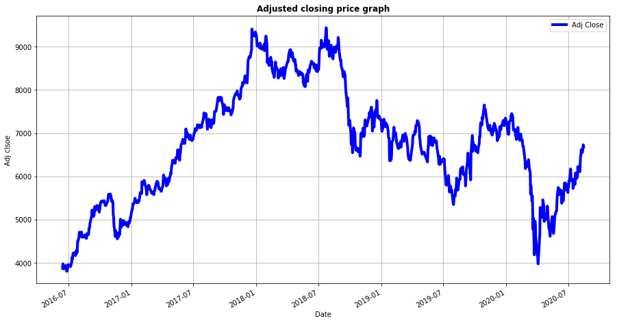


```python
# So we are going to do some historical analysis of RELIANCE company..
df_RELIANCE['Adj Close'].plot(legend=True,color='yellow',figsize=(15,8),linewidth=4)
plt.title("Adjusted closing price graph",weight= 'bold')
plt.ylabel("Adj clsoe")
plt.grid()
```


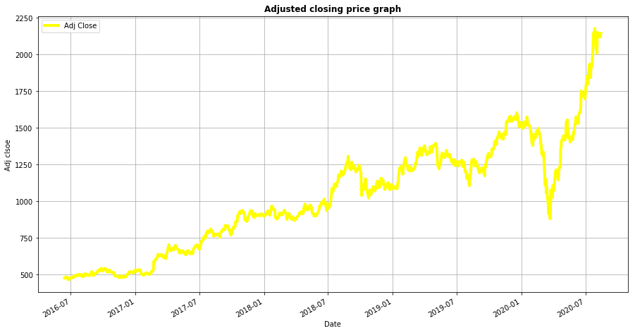


```python
# So we are going to do some historical analysis of BAJFINANCE company..
df_BAJFINANCE['Adj Close'].plot(legend=True,color='red',figsize=(15,8),linewidth=4)
plt.title("Adjusted closing price graph",weight= 'bold')
plt.ylabel("Adj close")
plt.grid()
```


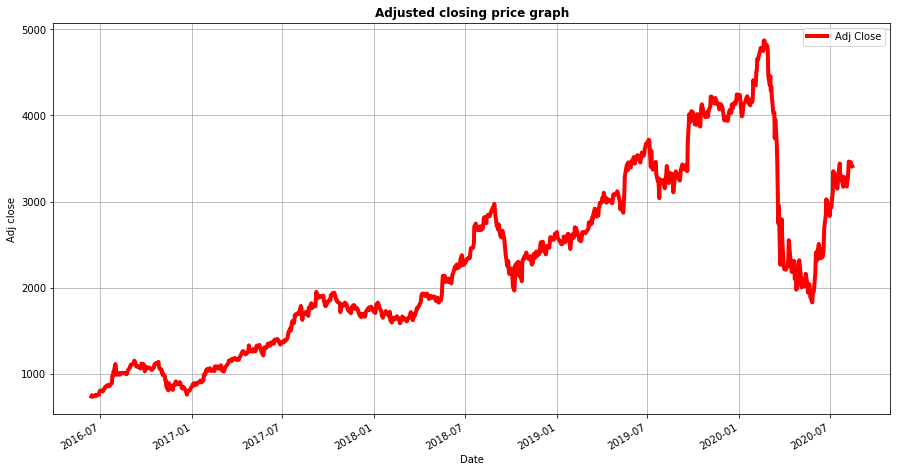


So, Below I have created a DataFrame consisting of the adjusted closing price of these stocks, first by making a list of these objects and using the join method...


```python
#stocks is the DataFrame for the adjusted closing price of the companies.
stocks = pd.DataFrame({"MARUTI.NS":df_MARUTI["Adj Close"],
                      "RELIANCE.NS": df_RELIANCE["Adj Close"],
                      "HINDUNILVR.NS": df_HINDUNILVR["Adj Close"],
                      "BAJFINANCE.NS": df_BAJFINANCE["Adj Close"]})
 
stocks.head()
```


<div>
<style scoped>
    .dataframe tbody tr th:only-of-type {
        vertical-align: middle;
    }

    .dataframe tbody tr th {
        vertical-align: top;
    }

    .dataframe thead th {
        text-align: right;
    }
</style>
<table border="1" class="dataframe">
  <thead>
    <tr style="text-align: right;">
      <th></th>
      <th>MARUTI.NS</th>
      <th>RELIANCE.NS</th>
      <th>HINDUNILVR.NS</th>
      <th>BAJFINANCE.NS</th>
    </tr>
    <tr>
      <th>Date</th>
      <th></th>
      <th></th>
      <th></th>
      <th></th>
    </tr>
  </thead>
  <tbody>
    <tr>
      <th>2016-06-14</th>
      <td>3875.778076</td>
      <td>477.243103</td>
      <td>805.988708</td>
      <td>736.901611</td>
    </tr>
    <tr>
      <th>2016-06-15</th>
      <td>3975.021973</td>
      <td>481.325012</td>
      <td>814.321533</td>
      <td>752.570374</td>
    </tr>
    <tr>
      <th>2016-06-16</th>
      <td>3856.515137</td>
      <td>477.267517</td>
      <td>818.790405</td>
      <td>747.165527</td>
    </tr>
    <tr>
      <th>2016-06-17</th>
      <td>3885.220947</td>
      <td>476.583160</td>
      <td>820.559326</td>
      <td>740.663940</td>
    </tr>
    <tr>
      <th>2016-06-20</th>
      <td>3902.878662</td>
      <td>484.062622</td>
      <td>818.743835</td>
      <td>741.617981</td>
    </tr>
  </tbody>
</table>
</div>


```python
stocks.plot(secondary_y=["MARUTI.NS","RELIANCE.NS"],grid=True,legend=True,figsize=(20,12),linewidth=4)
plt.title("Adjusted colsing graph of all companies",weight= 'bold')
```


    Text(0.5, 1.0, 'Adjusted colsing graph of all companies')


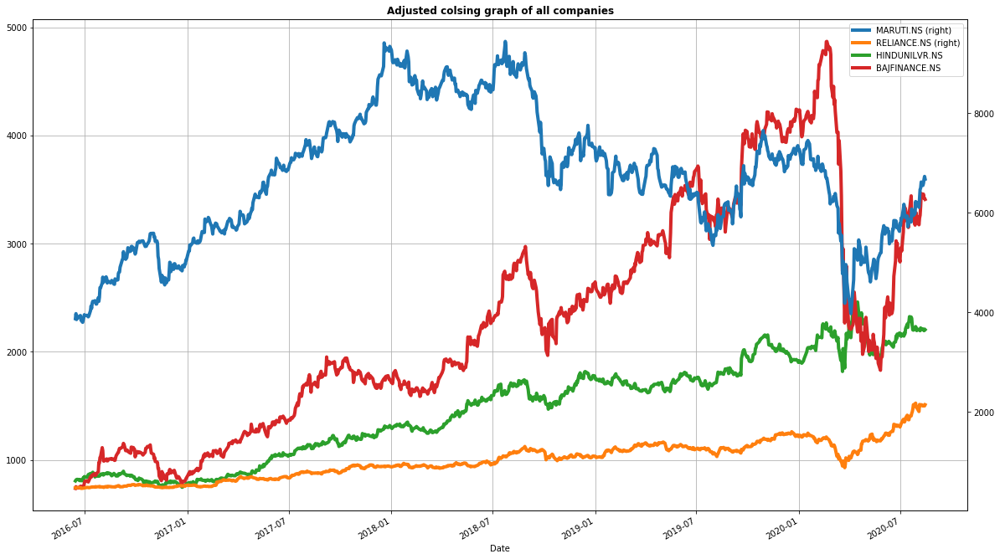


### Stock Change:-
now we are going to find out the STOCK CHANGE for all companies..


```python
stock_change = stocks.apply(lambda x: np.log(x) - np.log(x.shift(1)))

stock_change.plot(grid = True).axhline(y = 0, color = "black")
stock_change.plot(grid=True,figsize=(20,8))
plt.title("Stock change graph of all companies",weight='bold')
```


    Text(0.5, 1.0, 'Stock change graph of all companies')


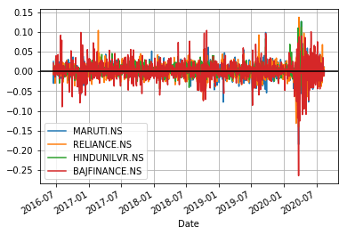


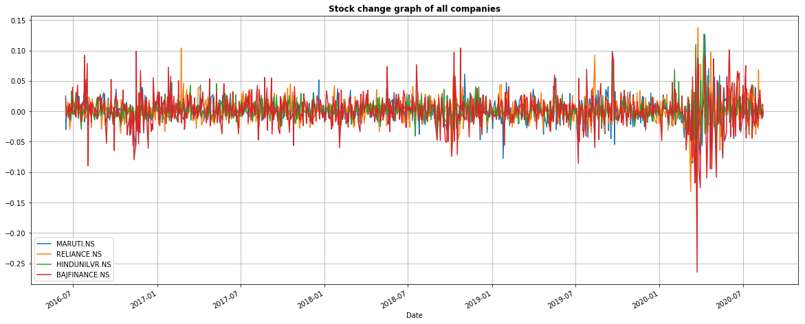


## Daily Returns:-
### So, below is the list of the DAILY RETURNS of the stock companies....


```python
# tech_daily_rets is the daily returns of the stocks company..
# pct_change is the percentage change of the stocks DataFrame and is stored in the tech_daily_rets DataFrame 
tech_daily_rets = stocks.pct_change()
```


```python
tech_daily_rets.dropna().head()
```


<div>
<style scoped>
    .dataframe tbody tr th:only-of-type {
        vertical-align: middle;
    }

    .dataframe tbody tr th {
        vertical-align: top;
    }

    .dataframe thead th {
        text-align: right;
    }
</style>
<table border="1" class="dataframe">
  <thead>
    <tr style="text-align: right;">
      <th></th>
      <th>MARUTI.NS</th>
      <th>RELIANCE.NS</th>
      <th>HINDUNILVR.NS</th>
      <th>BAJFINANCE.NS</th>
    </tr>
    <tr>
      <th>Date</th>
      <th></th>
      <th></th>
      <th></th>
      <th></th>
    </tr>
  </thead>
  <tbody>
    <tr>
      <th>2016-06-15</th>
      <td>0.025606</td>
      <td>0.008553</td>
      <td>0.010339</td>
      <td>0.021263</td>
    </tr>
    <tr>
      <th>2016-06-16</th>
      <td>-0.029813</td>
      <td>-0.008430</td>
      <td>0.005488</td>
      <td>-0.007182</td>
    </tr>
    <tr>
      <th>2016-06-17</th>
      <td>0.007443</td>
      <td>-0.001434</td>
      <td>0.002160</td>
      <td>-0.008702</td>
    </tr>
    <tr>
      <th>2016-06-20</th>
      <td>0.004545</td>
      <td>0.015694</td>
      <td>-0.002213</td>
      <td>0.001288</td>
    </tr>
    <tr>
      <th>2016-06-21</th>
      <td>0.005855</td>
      <td>-0.003131</td>
      <td>-0.010405</td>
      <td>0.008780</td>
    </tr>
  </tbody>
</table>
</div>


### So now we're going to print a jointplot that is going to compare the daily returns of MARUTI.NS with RELIANCE.NS


```python
g=sns.jointplot('MARUTI.NS','RELIANCE.NS',tech_daily_rets,color='red',kind='reg')
g.fig.set_figheight(8)
g.fig.set_figwidth(8)
```


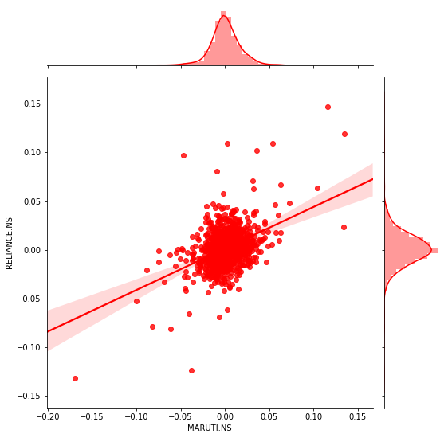


So now i'm going to print a jointplot that is going to compare the daily returns of HINDUNILVR.NS with BAJFINANCE.NS


```python
g=sns.jointplot('HINDUNILVR.NS','BAJFINANCE.NS',tech_daily_rets,color='darkblue',kind='reg')
g.fig.set_figheight(8)
g.fig.set_figwidth(8)
```


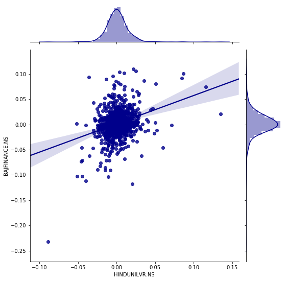


### Another representation with the help of PAIR PLOT


```python
sns.pairplot(tech_daily_rets.dropna())
```


    <seaborn.axisgrid.PairGrid at 0x1c8010fa668>


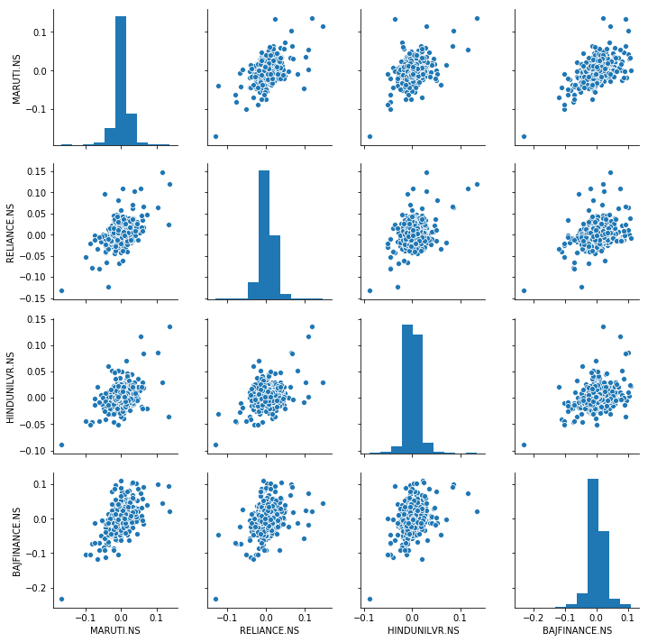


### Now if you want to find the correlation between the daily return values of the stocks then HEATMAP comes into play..


```python
#This is going to display a "heatmap" showing the correlation between the "tech_daily_return" values...
plt.figure(figsize = (12,7))
sns.heatmap(tech_daily_rets.dropna().head(),annot=True)

```


    <matplotlib.axes._subplots.AxesSubplot at 0x1c80262aba8>


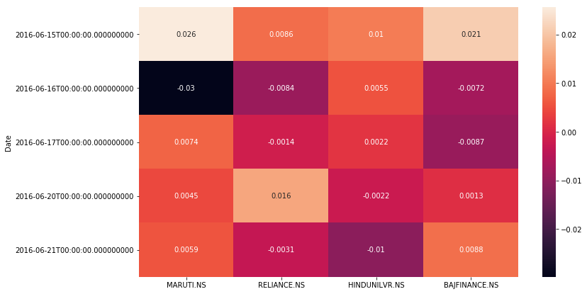


## RISK ANALYSIS:- 

#### There are many ways we can quantify risk, one of the most basic ways using the information we have gathered on daily percentage return, is by comparing the expected return with standard deviation.


```python
rets = tech_daily_rets.dropna()
```


```python
area = np.pi*20

plt.scatter (rets.mean(),rets.std(),s=area)
#set the plot axis title
plt.xlabel('Expected returns')
plt.ylabel('Risk')
plt.grid()
plt.title("Graph of Risk Analysis",weight='bold',fontsize=12)

for label, x, y in zip(rets.columns, rets.mean(), rets.std()):
      plt.annotate("",
            xy=(x, y), xycoords='data',
            xytext=(50, 50), textcoords='offset points',
            arrowprops=dict(arrowstyle='fancy', connectionstyle='arc3,rad=-0.3'))
            
```


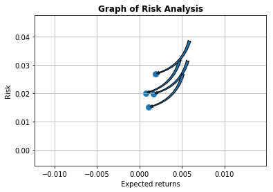


# Moving Average :-

### The moving average (MA) is a simple technical analysis tool that smooths out price data by creating a constantly updated average price. 


```python
df_MARUTI["15d"]=np.round(df_MARUTI["Adj Close"].rolling(window=15,center=False).mean(),2).plot(figsize=[10,8],legend=True,color='indianred',linewidth=4.3)
plt.title("MARUTI MOVING AVERAGE",weight='bold',fontsize=15)
plt.grid()

```


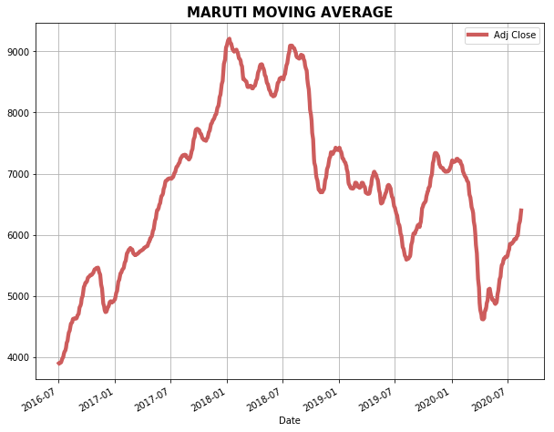


```python
df_HINDUNILVR["15d"]=np.round(df_HINDUNILVR["Adj Close"].rolling(window=15,center = False).mean(),2).plot(figsize=[10,8],legend=True,color='black',linewidth=4.3)
plt.title("HINDUNILVR MOVING AVERAGE",weight='bold',fontsize=15)
plt.grid()

```


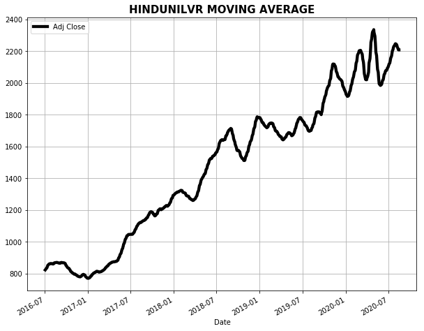


```python
df_RELIANCE["15d"]=np.round(df_RELIANCE["Adj Close"].rolling(window=15,center = False).mean(),2).plot(figsize=[10,8],legend=True,color='blue',linewidth=4.3)
plt.title("RELIANCE MOVING AVERAGE",weight='bold',fontsize=15)
plt.grid()
```


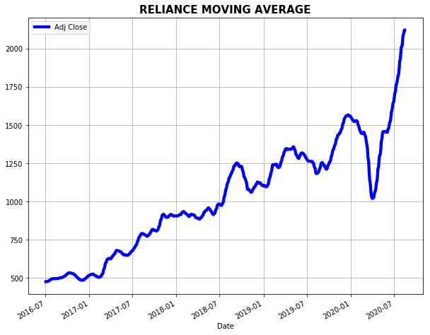


```python
df_BAJFINANCE["15d"]=np.round(df_BAJFINANCE["Adj Close"].rolling(window=15,center = False).mean(),2).plot(figsize=[10,8],legend=True,color='green',linewidth=4.3)
plt.title("BAJFINANCE MOVING AVERAGE",weight='bold',fontsize=15)
plt.grid()
```


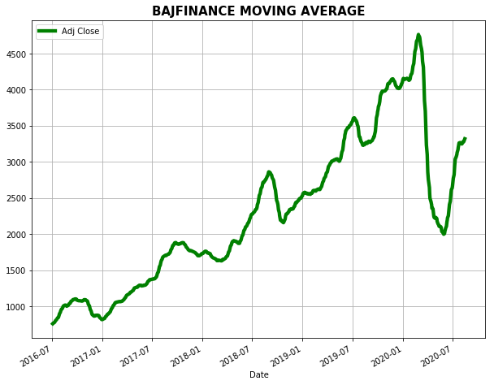


## Value Of Risk:-

### Let's go ahead and define a risk parameter for our stocks. We can treat value at risk as the amount of money we can expect to lose for a particular interval of time. There are several methods for finding out the value of risk.


### Value of risk by " MONTE CARLO METHOD"


#### using the monte carlo to run many trials with random market conditions, then will calculate the portfolio losses for each trials. After this will use the aggregation of all these simulations to establish how risky the stock is.


### MARUTI (Value of risk) by MONTE CARLO..


```python
days = 365

dt = 1/days

mu = tech_daily_rets.mean()["MARUTI.NS"]

sigma = tech_daily_rets.std()["MARUTI.NS"]

start_price = df_MARUTI["Open"][0]

```


```python
def stock_monte_carlo(start_price,days,mu,sigma):
    
    price = np.zeros(days)
    price[0]= start_price
    
    shock = np.zeros(days)
    drift = np.zeros(days)
    
    for x in range(1,days):
        # formula for finding the shock term 
        shock[x] = np.random.normal(loc=mu*dt,scale=sigma*np.sqrt(dt))
        # formula for finding the drift term
        drift[x] = mu*dt
        #formula of price..
        price[x] = price[x-1] + (price[x-1]*(drift[x]+shock[x]))
        
    return price    
        
        
```


```python
start_price=df_MARUTI["Open"][0]
start_price
```


    9144.0


```python

runs = 10000

simulation = np.zeros(runs)

for run in range(runs):
    simulation[run] = stock_monte_carlo(start_price,days,mu,sigma)[days-1]
    
```


```python

q = np.percentile(simulation,1)

plt.hist(simulation,bins=200)

#starting price
plt.figtext(0.6,0.8, s= "Start Price: $%.2f" %start_price)

#Mean ending price
plt.figtext(0.6,0.7, s= "Mean final Price: $%.2f" %simulation.mean())

#Variance of the price (within 99% confidence interval)
plt.figtext(0.6,0.6, s= "VaR(0.99): $%.2f" %(start_price - q,))

#display 1% qunatile
plt.figtext(0.15,0.8, s= "q(0.99): $%.2f" % q)

# plot a line at the 1% quantile result
plt.axvline(x=q,linewidth=4,color = 'r')

plt.grid()

#Title
plt.title(u"final price distribution for particular stock after %s days" % days , weight= 'bold')
```


    Text(0.5, 1.0, 'final price distribution for particular stock after 365 days')


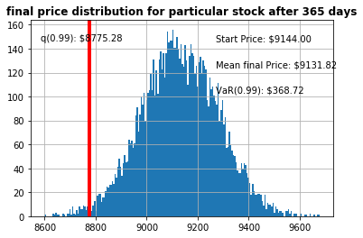


### RELIANCE (Value of risk) by MONTE CARLO..


```python
days = 365

dt = 1/days

mu = tech_daily_rets.mean()["RELIANCE.NS"]

sigma = tech_daily_rets.std()["RELIANCE.NS"]

start_price_1 = df_RELIANCE["Open"][0]
```


```python
def stock_monte_carlo(start_price_1,days,mu,sigma):
    
    price = np.zeros(days)
    price[0]= start_price_1
    
    shock = np.zeros(days)
    drift = np.zeros(days)
    
    for x in range(1,days):
        # formula for finding the shock term 
        shock[x] = np.random.normal(loc=mu*dt,scale=sigma*np.sqrt(dt))
        # formula for finding the drift term
        drift[x] = mu*dt
        #formula of price..
        price[x] = price[x-1] + (price[x-1]*(drift[x]+shock[x]))
        
    return price    
        
        
```


```python
start_price_1=df_RELIANCE["Open"][0]
start_price_1
```


    939.0999755859375


```python
runs = 10000

simulation = np.zeros(runs)

for run in range(runs):
    simulation[run] = stock_monte_carlo(start_price_1,days,mu,sigma)[days-1]
    
```


```python
q = np.percentile(simulation,1)

plt.hist(simulation,bins=200)

#starting price
plt.figtext(0.6,0.8, s= "Start Price: $%.2f" %start_price_1)

#Mean ending price
plt.figtext(0.6,0.7, s= "Mean final Price: $%.2f" %simulation.mean())

#Variance of the price (within 99% confidence interval)
plt.figtext(0.6,0.6, s= "VaR(0.99): $%.2f" %(start_price_1 - q,))

#display 1% qunatile
plt.figtext(0.15,0.8, s= "q(0.99): $%.2f" % q)

# plot a line at the 1% quantile result
plt.axvline(x=q,linewidth=4,color = 'r')


plt.grid()

#Title
plt.title(u"final price distribution for particular stock after %s days" % days , weight= 'bold')
```


    Text(0.5, 1.0, 'final price distribution for particular stock after 365 days')


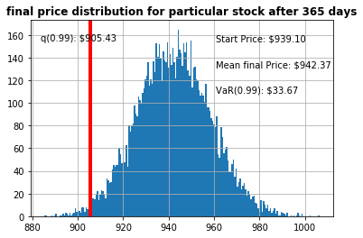


### HINDUNILVR (Value of risk) by MONTE CARLO..


```python
days = 365

dt = 1/days

mu = tech_daily_rets.mean()["HINDUNILVR.NS"]

sigma = tech_daily_rets.std()["HINDUNILVR.NS"]

start_price_2 = df_HINDUNILVR["Open"][0]
```


```python
def stock_monte_carlo(start_price_2,days,mu,sigma):
    
    price = np.zeros(days)
    price[0]= start_price_2
    
    shock = np.zeros(days)
    drift = np.zeros(days)
    
    for x in range(1,days):
        # formula for finding the shock term 
        shock[x] = np.random.normal(loc=mu*dt,scale=sigma*np.sqrt(dt))
        # formula for finding the drift term
        drift[x] = mu*dt
        #formula of price..
        price[x] = price[x-1] + (price[x-1]*(drift[x]+shock[x]))
        
    return price    
        
```


```python
start_price_2=df_HINDUNILVR["Open"][0]
start_price_2
```


    1451.4000244140625


```python
runs = 10000
simulation = np.zeros(runs)
for run in range(runs):
    simulation[run] = stock_monte_carlo(start_price_2,days,mu,sigma)[days-1]
    
```


```python
q = np.percentile(simulation,1)

plt.hist(simulation,bins=200)

#starting price
plt.figtext(0.6,0.8, s= "Start Price: $%.2f" %start_price_2)

#Mean ending price
plt.figtext(0.6,0.7, s= "Mean final Price: $%.2f" %simulation.mean())

#Variance of the price (within 99% confidence interval)
plt.figtext(0.6,0.6, s= "VaR(0.99): $%.2f" %(start_price_2 - q,))

#display 1% qunatile
plt.figtext(0.15,0.8, s= "q(0.99): $%.2f" % q)

#plot a line at the 1% quantile result
plt.axvline(x=q,linewidth=4,color = 'r')

#figsize
plt.plot(figsize=[25,8])

plt.grid()

#Title
plt.title(u"final price distribution for particular stock after %s days" % days , weight= 'bold')
```


    Text(0.5, 1.0, 'final price distribution for particular stock after 365 days')


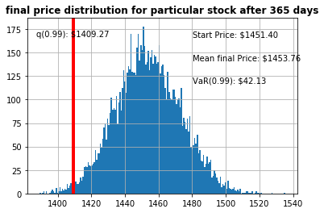


### BAJFINANCE (Value of risk) by MONTE CARLO..


```python
days = 365

dt = 1/days

mu = tech_daily_rets.mean()["BAJFINANCE.NS"]

sigma = tech_daily_rets.std()["BAJFINANCE.NS"]

start_price_3 = df_BAJFINANCE["Open"][0]

```


```python
def stock_monte_carlo(start_price_3,days,mu,sigma):
    
    price = np.zeros(days)
    price[0]= start_price_3
    
    shock = np.zeros(days)
    drift = np.zeros(days)
    
    for x in range(1,days):
        # formula for finding the shock term 
        shock[x] = np.random.normal(loc=mu*dt,scale=sigma*np.sqrt(dt))
        # formula for finding the drift term
        drift[x] = mu*dt
        #formula of price..
        price[x] = price[x-1] + (price[x-1]*(drift[x]+shock[x]))
        
    return price    
        
```


```python
start_price_3=df_BAJFINANCE["Open"][0]
start_price_3
```


    1935.0


```python
runs = 10000
simulation = np.zeros(runs)
for run in range(runs):
    simulation[run] = stock_monte_carlo(start_price_3,days,mu,sigma)[days-1]
    
```


```python
q = np.percentile(simulation,1)

plt.hist(simulation,bins=200)

#starting price
plt.figtext(0.6,0.8, s= "Start Price: $%.2f" %start_price_3)

#Mean ending price
plt.figtext(0.6,0.7, s= "Mean final Price: $%.2f" %simulation.mean())

#Variance of the price (within 99% confidence interval)
plt.figtext(0.6,0.6, s= "VaR(0.99): $%.2f" %(start_price_3 - q,))

#display 1% qunatile
plt.figtext(0.15,0.8, s= "q(0.99): $%.2f" % q)

#plot a line at the 1% quantile result
plt.axvline(x=q,linewidth=4,color = 'r')

#figsize
plt.plot(figsize=[25,8])

plt.grid()

#Title
plt.title(u"final price distribution for particular stock after %s days" % days , weight= 'bold')
```


    Text(0.5, 1.0, 'final price distribution for particular stock after 365 days')


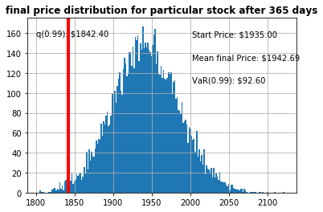


```python

```


```python

```


```python

```


```python

```
